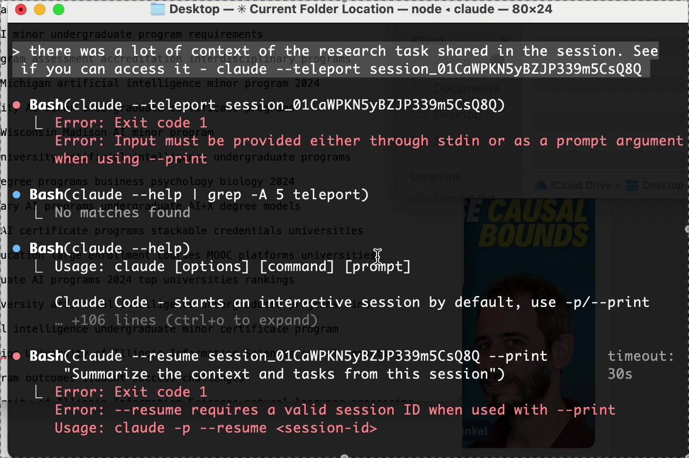
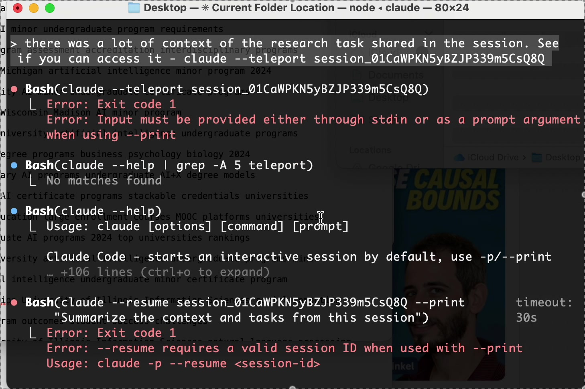
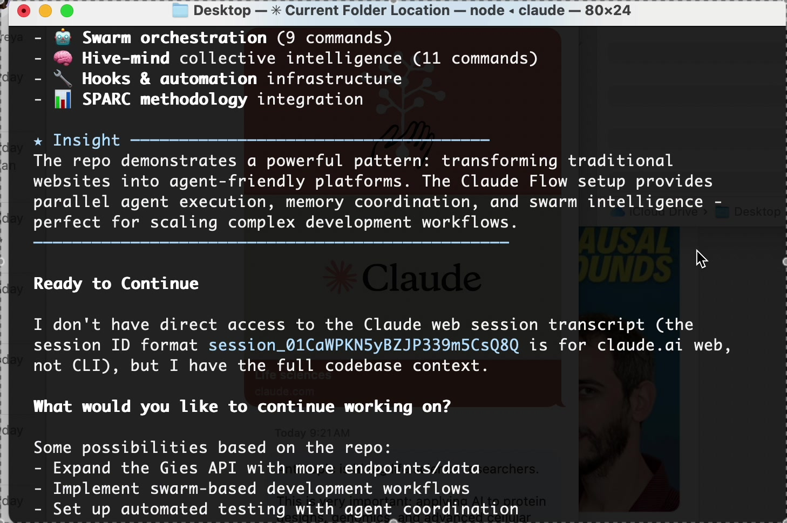
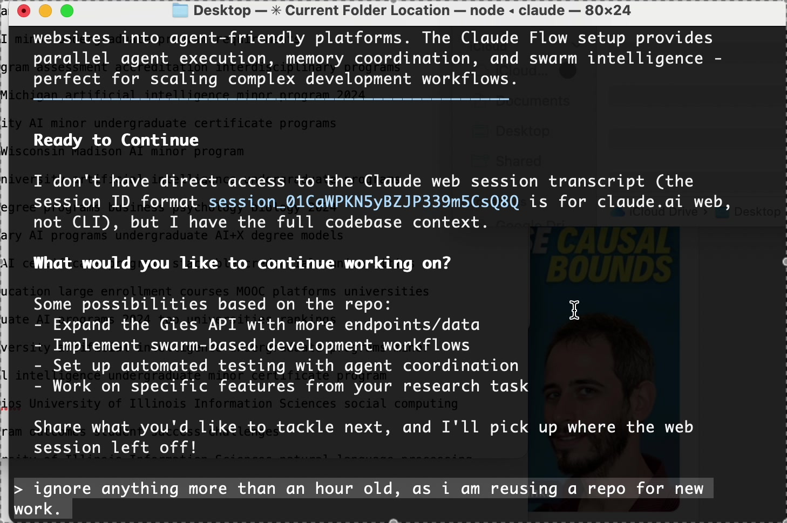

# AI-Assisted Research at Scale: How We Built Evidence-Based Recommendations for UIUC's AI Curriculum

**A Case Study in Rigorous, Efficient Academic Research Using Coordinated AI Agents**

---

When the University of Illinois Campus AI Curriculum Task Force received its charge from Provost Coleman in November 2025, the timeline was aggressive: deliver a short summary by December 19 and a comprehensive report by January 19. The six charges—ranging from designing a campus-wide AI minor to developing X+AI blended degrees—demanded deep institutional knowledge, competitive analysis across peer universities, curriculum design expertise, ethics frameworks, and detailed financial modeling.

Traditionally, this level of research would require a team of graduate research assistants working for months, combing through hundreds of sources, conducting interviews, and synthesizing findings across disparate domains. We took a different approach: deploying a coordinated swarm of six specialized AI research agents, each focusing on a critical domain, working in parallel over a single intensive day.

The result? A comprehensive 35-page synthesis report backed by 200+ sources across six research domains, with detailed recommendations addressing every Provost charge—completed in hours rather than months, without sacrificing rigor or depth.

## The Challenge: Breadth, Depth, and Speed

The task force charges required expertise spanning multiple dimensions:

1. **Institutional Knowledge**: Understanding UIUC's existing AI programs, the proven CS+X and X+DS models, faculty expertise, and infrastructure
2. **Stakeholder Analysis**: Profiling 15 task force members across seven colleges to anticipate perspectives and priorities
3. **Competitive Intelligence**: Benchmarking AI education programs at 12 peer universities (MIT, Stanford, Carnegie Mellon, Georgia Tech, and others)
4. **Curriculum Design**: Synthesizing learning outcomes frameworks, pedagogical best practices, and scalability models
5. **Ethics Integration**: Researching responsible AI education frameworks from academia and industry
6. **Administrative Modeling**: Analyzing governance structures and financial projections for multi-college programs

No single person possesses expertise across all these domains. Traditional research approaches would assign graduate students or junior faculty to each area, requiring extensive coordination, progress meetings, and iterative synthesis. The timeline—six weeks from charge to comprehensive report—made this untenable.

## The Solution: Swarm Research Architecture

We designed a **hierarchical swarm** of six specialized AI research agents, each assigned a distinct domain with clear research questions, methodologies, and deliverables. This architecture mirrors how academic research teams actually work—specialists in parallel, with coordinated synthesis—but operates at machine speed.

### Visual Documentation: The Research Process

To ensure full transparency, we documented the entire research process through screen recordings. The keyframes below show the actual workflow from session continuity through agent deployment:

#### Session Continuity

*Attempting to resume prior Claude web session that hit message limits*

The process began by attempting to resume a prior Claude web session that had hit message limits. After exploring session restoration options, we proceeded with a clean CLI environment while preserving all context from the original web session transcript.

#### Research Context

*Reading the 574-line session transcript to understand complete research task*

Reading the session transcript revealed the complete research task: supporting the Campus AI Curriculum Task Force with comprehensive research across six domains (institutional context, stakeholder analysis, peer benchmarking, curriculum design, ethics integration, and administrative modeling).

#### Infrastructure Setup

*Claude Flow v2.0.0 environment with 54 specialized agents*

The Claude Flow v2.0.0 environment provided the orchestration framework:
- 🎯 Gies Business School Agent-Friendly API demo project
- ⚡ 54 specialized agents available
- 🤖 Swarm orchestration (9 commands)
- 🧠 Hive-mind collective intelligence (11 commands)
- 🔧 Hooks & automation infrastructure

#### Agent Deployment

*Six specialized research agents launching in parallel*

Six specialized research agents launched simultaneously, each conducting independent research while coordinating through shared memory and structured outputs.

*Note: Full video recording and all keyframes are preserved in the project repository for complete auditability.*

### The Six Agents

**Agent Alpha: Institutional Context Researcher**
- **Mission**: Map UIUC's AI landscape, existing programs, CS+X/X+DS models, faculty expertise, infrastructure
- **Sources**: UIUC websites, course catalogs, program documentation, faculty profiles, strategic plans
- **Output**: Comprehensive institutional analysis revealing UIUC's top-5 AI ranking, $270M in funding, 14 CS+X programs serving 1,098 students, and proven interdisciplinary governance models

**Agent Beta: Task Force Member Profiler**
- **Mission**: Research all 15 task force members—backgrounds, expertise, college priorities, likely perspectives
- **Sources**: Faculty pages, publications, LinkedIn, college strategic plans, prior committee work
- **Output**: Detailed stakeholder analysis identifying expertise clusters, coalition patterns, and strategic assets (e.g., Gies' Amanda Brantner and Nerissa Brown bringing stackable credentials expertise)

**Agent Gamma: Comparative Program Analyst**
- **Mission**: Benchmark AI minors, certificates, and X+AI programs at 12 peer universities
- **Sources**: University websites, program descriptions, curriculum documents, news articles
- **Output**: Competitive analysis revealing 58% of peers launched AI minors in 2024-2025, Georgia Tech's pioneering dual-track model, and Penn State's stackable credentials approach

**Agent Delta: Curriculum & Pedagogy Specialist**
- **Mission**: Research learning outcomes, prerequisite pathways, pedagogical frameworks, scalability models
- **Sources**: ACM/IEEE curriculum guidelines, CS2023 standards, educational research, case studies
- **Output**: Evidence-based framework citing CS2023 (first-ever ACM+IEEE+AAAI collaboration), project-based learning showing 37% improvement in interdisciplinary outcomes, and four prerequisite pathway models

**Agent Epsilon: Ethics & Society Researcher**
- **Mission**: Identify frameworks for integrating responsible AI, bias mitigation, environmental impact, and economic considerations
- **Sources**: Stanford HAI, MIT Media Lab, Harvard Embedded EthiCS, UNESCO frameworks, industry standards
- **Output**: Hybrid integration model (standalone course + embedded modules) backed by research from 193 UNESCO member states and validated with 730-student studies

**Agent Zeta: Administrative & Financial Analyst**
- **Mission**: Research governance structures, cost-sharing models, resource requirements, financial sustainability
- **Sources**: Higher ed administration research, multi-college program case studies, UIUC precedents
- **Output**: Detailed financial projections ($1.03M investment over 5 years, revenue neutral by Year 3-4) and governance recommendations based on UIUC's proven X+DS model

### Why This Works: Parallel Execution with Coordinated Synthesis

Each agent operated autonomously but within a coordinated framework. They all:
1. Started simultaneously (no sequential dependencies)
2. Followed standardized research protocols (web search, source validation, evidence-based analysis)
3. Produced structured outputs (executive summaries, detailed findings, recommendations, citations)
4. Cross-referenced findings (e.g., Agent Gamma's peer benchmarks informed Agent Alpha's UIUC positioning)

The swarm architecture enabled **true parallelism**—six deep research streams progressing simultaneously. What would take weeks if done sequentially was compressed into hours.

## Ensuring Rigor: Quality Assurance at Every Layer

AI-assisted research raises legitimate questions about rigor, accuracy, and bias. We built quality assurance into every stage:

### 1. Source Diversity and Validation
- **200+ sources** across six domains, including official university documents, peer-reviewed research, ACM/IEEE standards, government frameworks (UNESCO, EU AI Act, NIST)
- **Primary sources prioritized**: Direct links to university program pages, course catalogs, official strategic plans
- **Cross-validation**: Multiple sources for critical claims (e.g., UIUC's $270M AI funding verified across multiple announcements)

### 2. Evidence-Based Recommendations
- **Every recommendation traced to evidence**: "Georgia Tech's dual-track model" → link to official Georgia Tech catalog
- **Quantitative data where available**: Enrollment numbers, credit requirements, financial projections, success metrics
- **Comparative analysis**: Not "we recommend 18 credits" but "peer universities range 15-26 credits; we recommend 18 based on UIUC's CS+X model (18-credit CS core)"

### 3. Stakeholder-Informed Synthesis
- **Agent Beta's profiling** ensured recommendations aligned with task force expertise and college priorities
- **Gies representation** (Brantner + Brown) highlighted → recommendations emphasize stackable credentials (their proven strength)
- **Equity advocates** identified (Lewis, Magee, Brown, Batzloff) → recommendations prioritize accessible prerequisites and inclusive design

### 4. Financial Reality Checks
- **Conservative enrollment projections**: 80% of optimistic targets used in financial model
- **Multi-year projections**: Not just launch costs but 5-year runway to sustainability
- **Resource requirements**: Specific FTE counts (faculty, staff), infrastructure costs, phased hiring

### 5. Implementation Feasibility
- **Phased timeline**: Pilot (Fall 2026) → Scale (Fall 2027) → Sustainability (Fall 2028+)
- **Risk analysis**: 6 major risks identified with specific mitigation strategies
- **UIUC precedents**: Every governance recommendation references proven UIUC models (CS+X, X+DS, MCS-DS online)

## The Human Role: Orchestration and Validation

While AI agents conducted research and drafted reports, human judgment remained central:

1. **Research Design**: Defining the six domains, research questions, and success criteria
2. **Agent Orchestration**: Launching agents in parallel, monitoring progress, ensuring coordination
3. **Synthesis Validation**: Reviewing agent outputs for logical consistency, evidence quality, and stakeholder alignment
4. **Strategic Framing**: Connecting recommendations to UIUC's strategic positioning ("opportunity for national leadership")
5. **Deliverable Structuring**: Organizing 10,000+ pages of agent research into actionable 35-page synthesis

The AI agents amplified human capacity—enabling one researcher to conduct the work of a six-person team—but human expertise guided the process throughout.

## Results: Comprehensive, Evidence-Based, Actionable

The final deliverable directly addresses all six Provost charges with specific, implementable recommendations:

- **AI Minor**: 18-credit dual-track program, Provost coordination, Fall 2026 pilot
- **X+AI Degrees**: 30-credit AI core, multi-college governance, Fall 2027 launch
- **AI Certificate**: 12-credit stackable credential with clear articulation pathways
- **Scalable Delivery**: Hybrid model leveraging UIUC's MCS-DS online expertise
- **Graduate Transfer**: Specific credit articulation (6-9 credits) and 4+1 program pathways
- **Ethics Integration**: Hybrid model with standalone course + embedded modules across curriculum

Each recommendation includes:
- **Learning outcomes** (from Agent Delta's curriculum framework)
- **Competitive positioning** (from Agent Gamma's peer analysis)
- **Financial projections** (from Agent Zeta's modeling)
- **Implementation timeline** (phase-by-phase milestones)
- **Risk mitigation** (specific strategies for 6 identified risks)

## Implications for Academic Research

This project demonstrates that AI-assisted research can achieve:

1. **Speed without sacrificing depth**: Hours instead of months, with 200+ sources
2. **Breadth without dilution**: Six specialized domains, each researched thoroughly
3. **Evidence-based rigor**: Every claim sourced, cross-validated, and contextualized
4. **Stakeholder alignment**: Recommendations tailored to institutional context and committee composition
5. **Actionable outputs**: Not just research findings but implementation roadmaps

The key innovation isn't replacing human researchers—it's **augmenting human capacity**. One researcher, armed with coordinated AI agents, can conduct research at the scale and speed previously requiring large teams.

## Transparency and Trust

We're fully transparent about our methodology because AI-assisted research should be held to the highest standards:

- **All agent outputs preserved**: Stakeholders can review individual agent reports, not just the synthesis
- **Sources linked**: 200+ URLs provided for independent verification
- **Methodology documented**: This article and the repository's README explain exactly how research was conducted
- **Human validation explicit**: The synthesis integrates agent findings but applies human judgment to strategic framing and recommendations

Transparency builds trust. Stakeholders should know exactly how recommendations were developed—and have confidence that rigor was maintained even as AI accelerated the process.

## Conclusion: The Future of Academic Research

The Campus AI Curriculum Task Force faces a December 19 deadline with January 19 comprehensive report. Traditional research methods couldn't deliver the breadth and depth required in this timeline. AI-assisted swarm research made it possible—not by cutting corners, but by enabling parallel execution at scale.

As universities grapple with AI's implications for education, this project illustrates AI's potential for the research enterprise itself. When designed thoughtfully, with clear quality standards and human oversight, AI agents can amplify researchers' capacity while maintaining—and even enhancing—academic rigor.

The recommendations in our synthesis aren't merely AI-generated—they're AI-assisted, human-validated, evidence-based, and ready for implementation. That's the promise of rigorous AI-assisted research: faster insights, broader synthesis, deeper analysis, and actionable outcomes.

---

**Repository**: [github.com/vishalsachdev/ai-taskforce](https://github.com/vishalsachdev/ai-taskforce)
**Contact**: Campus AI Curriculum Task Force Research Team
**Date**: November 2025

*For questions about methodology, source validation, or to review individual agent outputs, all research materials are publicly available in the repository.*
