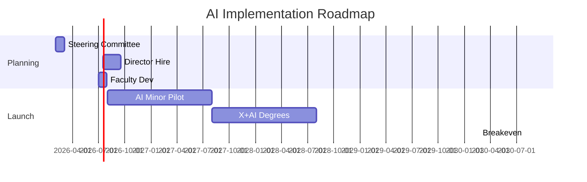

# Executive Summary: UIUC AI Curriculum Strategy

**Prepared for Provost & Deans** | **Nov 2025** | **AI Swarm Research (6 Agents, 200+ Sources)**

## 🎯 6 Key Recommendations (Provost Charges)
1. **AI Minor** (Fall 2026): 18cr dual-track (Technical/Apps), Provost coord., 115 Y1 students
2. **X+AI Degrees** (Fall 2027): 30cr AI core + domain (Business+AI pilots), CS+X model
3. **Stackable Certificate** (Fall 2026): 12cr → minor/degree pathway, hybrid delivery
4. **Scalable Hybrid Model**: In-person labs + online (MCS-DS proven)
5. **Grad Transfer**: 6-12cr articulation to MS/PhD
6. **Ethics Hybrid**: Standalone course + embedded modules (UNESCO/Microsoft frameworks)

## 💰 5-Year Financials
| Year | Students | Cost | Revenue | Net    |
|------|----------|------|---------|--------|
| 1    | 115      | $430K| $180K  | -$250K |
| 2    | 225      | $625K| $360K  | -$265K |
| 3    | 350      | $825K| $630K  | -$195K |
| 4    | 450      | $975K| $900K  | -$75K  |
| 5    | 550      | $1M  | $1.1M  | +$75K  |

**Total Invest: $1.03M** | **Breakeven: Y5** | **ROI: Positive Y6+**

## 📅 Timeline (Mermaid Gantt)

## ⚠️ Top Risks & Mitigations
- **Faculty Capacity**: Phased pilot, buyouts, cross-listing
- **Enrollment Shortfall**: Marketing, stackables, industry partners
- **Quality**: Peer review, pilot assess, advisory board

**UIUC Advantage**: Top-5 AI ($270M funded), CS+X proven (14 programs). **Act Now** for national leadership.

[Full Synthesis →](research/TASK-FORCE-SYNTHESIS) | [Methodology →](RESEARCH-METHODOLOGY-ARTICLE)